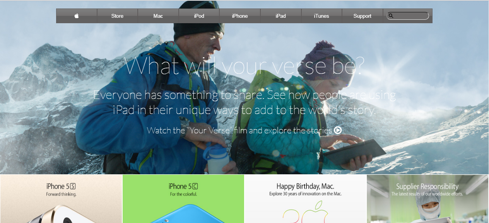

# microverse-old-apple.com-clone
> Microverse inspired project to create a clone of the old version of [apple.com](https://web.archive.org/web/20140301004610/http://www.apple.com/) using [flex](https://www.w3schools.com/css/css3_flexbox.asp) and [float](https://www.w3schools.com/css/css_float.asp) css properties.

This project is meant to test knowledge on backgrounds and gradients.

## Built With

- HTML,
- CSS

## Live Demo

View the live demo [here](https://raw.githack.com/dxania/microverse-old-apple.com-clone/master/index.html)

## Authors

👤 **Daizy Obura**

- Github: [@dxania](https://github.com/dxania)

## Show your support

Give a ⭐️ if you like this project!
